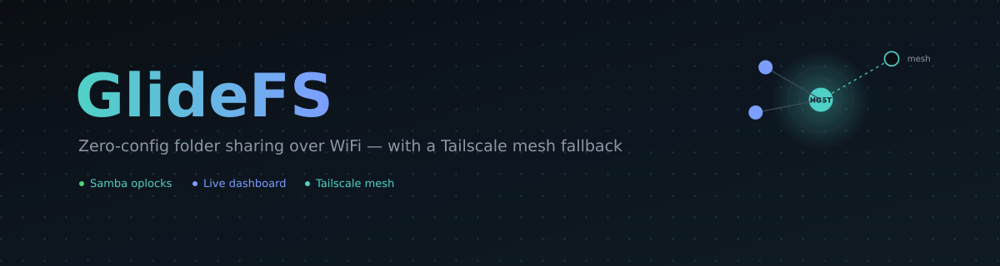
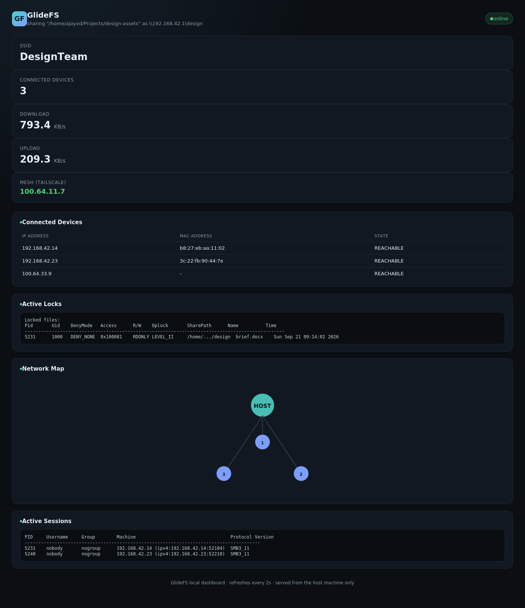
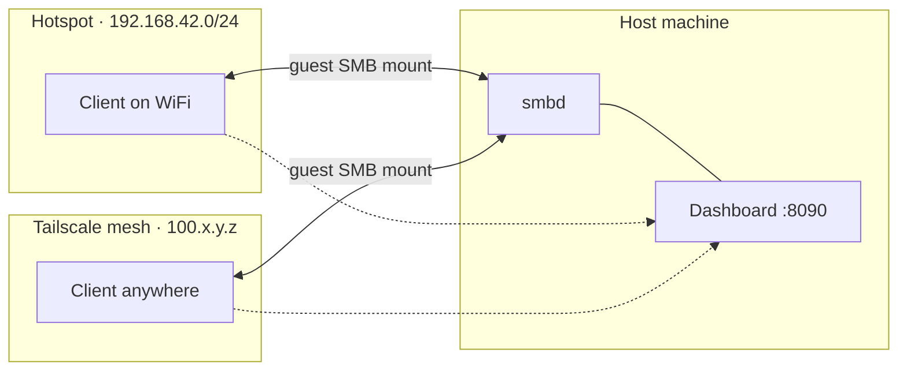

<div align="center">



<br/>


<h3>A shared folder that just works — over a WiFi hotspot, with a Tailscale mesh fallback for when you're not in the same room.</h3>

<p>
<a href="#-quick-start">Quick Start</a> ·
<a href="#-features">Features</a> ·
<a href="#-screenshot">Screenshot</a> ·
<a href="#-usage">Usage</a> ·
<a href="#-command-reference">Commands</a> ·
<a href="#%EF%B8%8F-troubleshooting">Troubleshooting</a>
</p>

</div>

<br/>

GlideFS turns any folder into something a small group of people can share like a normal local directory — no cloud account, no port forwarding, no manual network setup. One machine hosts: it broadcasts a WiFi hotspot, serves the folder over Samba, and shows a live dashboard of who's connected and what's locked. Other machines join the hotspot and the folder just appears, mounted like it's local. Optionally, the host can also join a **Tailscale** mesh so people outside WiFi range can connect too — over the *same* running share, with zero downtime.

<br/>

## Quick Start

```bash
# on the host
git clone --recurse-submodules <this repo's URL> && cd glidefs
make && sudo make install
sudo glidefsctl deps --install                    # grab whatever's missing
sudo glidefsctl share ~/Projects -n team -s TeamNet -p supersecret

# on another laptop
sudo glidefsctl connect team -s TeamNet -p supersecret
```

That's it — `~/GlideFS/team` now behaves like a normal local folder on both machines.

<br/>

## Why GlideFS

Sharing a folder with a couple of people shouldn't require a cloud account, opening ports on your router, or fighting with `rsync` flags. GlideFS exists for the *"just get this folder onto their laptop, now"* moment.

- **Zero network configuration** — no router login, no port forwarding, no static IPs to hand out
- **No accounts, no cloud** — files never leave your devices
- **It behaves like a real folder** — `ls`, `cp`, opening files in your editor — all of it just works, because it *is* a normal SMB mount, not a sync client with its own quirks
- **You always know what's happening** — a live dashboard shows exactly who's connected and which files are locked, in real time
- **Reach beyond the room, when you need to** — add Tailscale and the same share becomes reachable from anywhere, with the local hotspot still working exactly as before

<br/>

## Features

| | Feature | Details |
|---|---|---|
| 1 | **One-command hosting** | `glidefsctl share <path> -n <name>` stands up the hotspot, the Samba share, and the dashboard in one go |
| 2 | **Dual transport** | Hotspot (LAN) and Tailscale (mesh/WAN) both work *simultaneously* against the same live share — adding the mesh never interrupts anyone already connected |
| 3 | **Automatic path selection** | `connect` with both `-s` and `-t` tries the hotspot first, then falls back to the Tailscale IP automatically if it's out of range |
| 4 | **Native file locking** | Conflict prevention is pure Samba oplocks — a second writer gets the OS's real "file is locked" error, never a `file (conflicted copy).txt` |
| 5 | **Live observability dashboard** | A dependency-free embedded web server shows connected devices, live throughput, active sessions/locks, and mesh status — refreshing every 2 seconds |
| 6 | **Guest-simple mounts** | Clients don't manage credentials for the share itself — the WiFi password gets you in, everything else is zero-config guest access mapped to your own user |
| 7 | **Dependency doctor** | `glidefsctl deps` detects your distro's package manager and tells you (or auto-installs) exactly what's missing |
| 8 | **Clean teardown** | `unshare`/`disconnect` tear down exactly what GlideFS started, and leave everything else on your system untouched |

<br/>

## Screenshot

<div align="center">

<br/>
<sub>The live dashboard at <code>http://192.168.42.1:8090</code> — shown here with example data</sub>
</div>

<br/>

## Architecture



`smbd` listens on every interface at once (`bind interfaces only = no`) — so bringing Tailscale up never restarts anything or interrupts the clients already on the hotspot. Path selection between the two happens on the **client**, at connect time.

<br/>

## Requirements

<details>
<summary><strong>Host</strong> — click to expand</summary>
<br/>

- Linux with a WiFi adapter capable of AP (master) mode
- `hostapd`, `dnsmasq`, `nftables`, `iproute2`, `iw`, `rfkill`
- `samba` (for `smbd`)
- `tailscale` — only if you want the mesh fallback
- root privileges (hotspot creation, Samba, and mounting are all privileged operations)

```bash
# Debian/Ubuntu
sudo apt install hostapd dnsmasq nftables iproute2 iw rfkill samba

# Arch
sudo pacman -S hostapd dnsmasq nftables iproute2 iw rfkill samba
```

Tailscale isn't in the default Debian/Ubuntu repos, so it needs its own install step there:

```bash
# Debian/Ubuntu
curl -fsSL https://tailscale.com/install.sh | sh

# Arch
sudo pacman -S tailscale
```

</details>

<details>
<summary><strong>Client</strong> — click to expand</summary>
<br/>

- `cifs-utils` (provides `mount.cifs`)
- NetworkManager (`nmcli`) — needed to join the hotspot automatically; not needed if you only ever connect over Tailscale
- `tailscale` — only if connecting over the mesh path

```bash
sudo apt install cifs-utils network-manager
```

</details>

Don't want to look any of this up by hand? Skip straight to `glidefsctl deps` below.

<br/>

## Build

```bash
git clone --recurse-submodules <this repo's URL>
cd glidefs
make                  # builds bin/glidefsctl and bin/hotspotctl (vendored)
sudo make install     # installs both to /usr/local/bin
```

`glidefsctl` looks for `hotspotctl` next to itself first, then on `PATH`, then in `/usr/local/bin` and `/usr/bin` — so `make` (without installing) works too, since both binaries land in `bin/` together.

Already cloned without `--recurse-submodules`? The vendored `hotspotctl` directory will be empty until you run:

```bash
git submodule update --init --recursive
```

<br/>

## Check your dependencies

```bash
glidefsctl deps                    # check both host + client requirements
glidefsctl deps --host             # host only
glidefsctl deps --client           # client only
sudo glidefsctl deps --install     # auto-install what's missing (best-effort)
```

`deps --install` detects `apt`/`pacman`/`dnf`/`zypper`/`apk` and runs the right install command. Tailscale gets special handling on apt-based systems — `deps` gives you the correct one-liner instead of pretending `apt-get install tailscale` will work.

<br/>

## Usage

### Host a folder — hotspot only

```bash
sudo glidefsctl share ~/Projects/design-assets -n design -s DesignTeam -p supersecret
```

| Flag | Meaning |
|---|---|
| `-n <name>` | **required** — the Samba share name |
| `-s <ssid>` | optional — defaults to `GlideFS-<name>` |
| `-p <password>` | optional — auto-generated and printed if omitted |
| `-d` | debug mode, keeps `hostapd`/`dnsmasq` output on the console |

This starts the access point, writes `/run/glidefs/smb.conf`, starts `smbd` against it, starts the dashboard on port 8090, and prints the exact `connect` command to hand to collaborators.

### Host a folder — with Tailscale mesh fallback

Add `-k <tailscale-authkey>` to also bring the host onto your tailnet, so people who aren't in WiFi range can still connect:

```bash
sudo glidefsctl share ~/Projects/design-assets -n design -s DesignTeam -p supersecret -k tskey-auth-xxxxx
```

> Generate a reusable auth key at [login.tailscale.com/admin/settings/keys](https://login.tailscale.com/admin/settings/keys).

This doesn't restart or reconfigure anything already running — the moment Tailscale comes up, the share is reachable on the hotspot subnet *and* the tailnet at once, with zero interruption to anyone already connected. If Tailscale setup fails for any reason, `share` logs a warning and keeps the hotspot running rather than aborting the whole thing.

On success, the summary prints both connect commands ready to copy-paste:

```
    SSID       : DesignTeam
    Password   : supersecret
    Share      : design  ->  /home/you/Projects/design-assets
    Dashboard  : http://192.168.42.1:8090
    Mesh IP    : 100.64.1.7 (Tailscale)

On a device that's joining the hotspot, run:
    sudo glidefsctl connect design -s DesignTeam -p supersecret

On a remote device already on your tailnet, run:
    sudo glidefsctl connect design -p supersecret -t 100.64.1.7
```

### Connect from another machine

**On the hotspot (same WiFi range):**
```bash
sudo glidefsctl connect design -s DesignTeam -p supersecret
```

**Over Tailscale only (skip WiFi entirely):**
```bash
sudo glidefsctl connect design -p supersecret -t 100.64.1.7 -k tskey-auth-xxxxx
```

**Automatic path selection (both available):**
```bash
sudo glidefsctl connect design -p supersecret -s DesignTeam -t 100.64.1.7
```

Any of these mount `//<host>/design` at `~/GlideFS/design`, owned by your user, not root. Pass `-m <path>` to mount somewhere else.

```bash
sudo glidefsctl disconnect design
```

### Check status / stop sharing

```bash
glidefsctl status
sudo glidefsctl unshare
```

`unshare` stops `smbd`, the dashboard, and the hotspot — and, only if this particular share actually brought Tailscale up, logs the host out of the tailnet.

<br/>

## Dashboard

Once a share is active, open `http://192.168.42.1:8090` from any device on the hotspot, or the host's Tailscale IP from anywhere on the mesh. It polls `/api/status` every 2 seconds and shows:

- SSID, share path, and interface
- Live download & upload throughput
- Connected devices (from `ip neighbour`)
- Active Samba sessions and locks (from `smbstatus`)
- Mesh status — the host's Tailscale IP if the fallback is active, or "Off"

No login, no setup — it's just a status page for the network you're already on.

<br/>

## How locking works

Conflict prevention is handled natively by Samba's **oplocks** — there's no GlideFS-specific "who wins" logic to get wrong. When one client has a file open, a second client gets the OS's normal "file is locked" behavior instead of silently creating a `file (conflicted copy).txt`. `smbstatus -L`, surfaced live on the dashboard, shows exactly which files are locked and by whom — and this works identically whether a client is connected over the hotspot or the Tailscale mesh, since it's the same `smbd` process either way.

<br/>

## Dual-transport — what it means (and its current limit)

GlideFS picks between two independent transports for the **same** live share:

| Transport | Strength | Requirement |
|---|---|---|
| Hotspot (LAN) | Lowest latency, works with no internet at all | WiFi range of the host |
| Tailscale (mesh/WAN) | Works from anywhere | Both machines on the same tailnet |

`connect` with both `-s` and `-t` implements automatic path selection **at connect time**: it tries the hotspot first and falls back to the mesh IP if the hotspot doesn't answer. What it doesn't do *yet* is continuously monitor an already-mounted share and silently remount it if a client's network changes mid-session — e.g. walking out of WiFi range mid-transfer. That's a reasonable next step, just not implemented here. If the hotspot drops mid-session today, re-run `connect` (with `-t` set) to pick up the mesh path.

<br/>

## Project layout

<details>
<summary>Click to expand</summary>
<br/>

```
glidefs/
├── Makefile                 top-level build (glidefsctl + vendored hotspotctl)
├── include/                 headers
├── src/
│   ├── main.c                 entry point / command dispatch
│   ├── cli.c                   command implementations (init/share/unshare/status/connect/disconnect/deps)
│   ├── hotspot.c                 wraps hotspotctl start/stop
│   ├── network.c                  Tailscale lifecycle (up/down/self IP)
│   ├── share.c                     generates smb.conf, starts/stops smbd
│   ├── dashboard.c                  embedded HTTP server + JSON status API
│   ├── client.c                      nmcli join + CIFS mount/umount (hotspot and mesh paths)
│   ├── deps.c                         dependency detection + install helper
│   ├── state.c                         /run/glidefs/glidefs.state read/write
│   └── util.c                           logging, run_cmd, mkdir -p, root check
├── assets/dashboard.html      dashboard source (embedded into the binary at build time)
└── third_party/hotspotctl/    vendored hotspotctl dependency (git submodule)
```

</details>

<br/>

## Command reference

<details>
<summary>Click to expand</summary>
<br/>

| Command | Who runs it | What it does |
|---|---|---|
| `glidefsctl init` | either | First-run setup; generates a local node id |
| `glidefsctl share <path> -n <name> [-s ssid] [-p password] [-k authkey] [-d]` | host | Starts the hotspot, Samba share, dashboard, and optional Tailscale mesh |
| `glidefsctl unshare` | host | Tears everything the current share started back down |
| `glidefsctl status` | either | Shows the current share's live state |
| `glidefsctl connect <name> -p password [-s ssid] [-t ts_ip] [-k authkey] [-m mountpoint]` | client | Joins the hotspot and/or mesh, then mounts the share |
| `glidefsctl disconnect <name> [-m mountpoint]` | client | Unmounts a previously connected share |
| `glidefsctl deps [--install] [--host\|--client]` | either | Reports or installs missing runtime dependencies |

</details>

<br/>

## Troubleshooting

<details>
<summary>Click to expand</summary>
<br/>

- **"hotspotctl not found"** — run `make` from the repo root (it builds the vendored copy), or check the submodule is actually checked out (`git submodule update --init --recursive`).
- **Missing dependencies** — run `glidefsctl deps` for a precise report, or `sudo glidefsctl deps --install` to fix most of it automatically.
- **Hotspot won't start** — check `/run/hotspotctl/hostapd.log`; most often this is a WiFi card that doesn't support AP/master mode, or NetworkManager still holding the interface.
- **Client can't join the hotspot automatically** — `nmcli` is required for the WiFi auto-join step; without it, connect to the SSID manually and the mount step will still succeed once you're on `192.168.42.0/24`. This doesn't affect the `-t` (Tailscale-only) path.
- **Tailscale connect fails** — check `tailscale status` on both machines; they need to be on the *same* tailnet. Auth keys expire, and reusable keys can be revoked from the Tailscale admin console.
- **`share -k` says "Tailscale setup failed"** — the hotspot is still up and working; check `journalctl -u tailscaled`, or re-run `sudo tailscale up --authkey=...` manually to see the real error, then re-run `share` once it's sorted.

</details>

<br/>

<div align="center">

---

Built with plain C, `smbd`, and a healthy dislike of manual network configuration.

**License** — add your license of choice here (MIT, Apache-2.0, GPL-3.0, etc.) before publishing.

</div>
